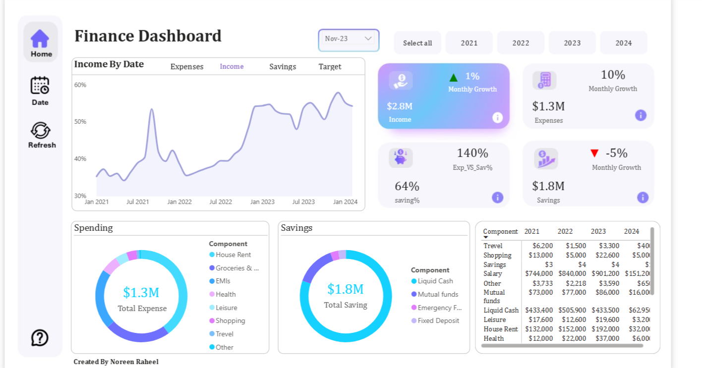
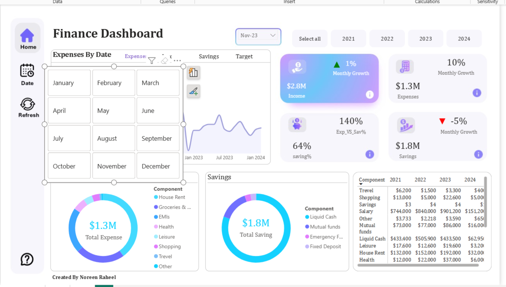
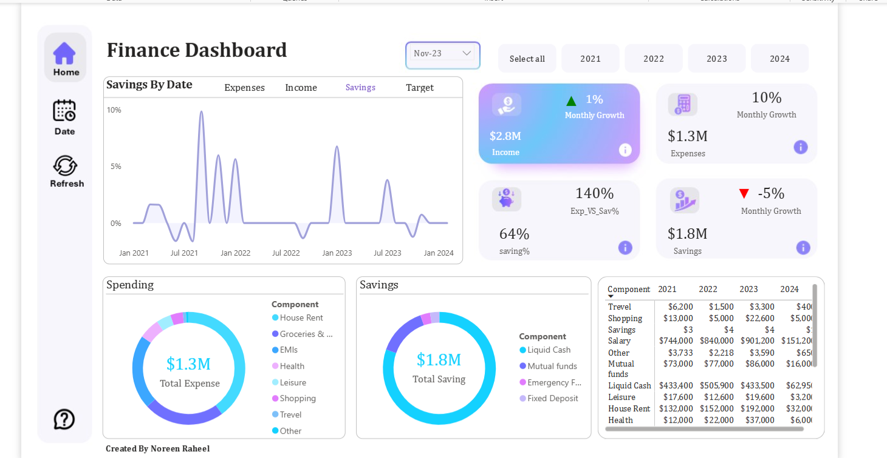
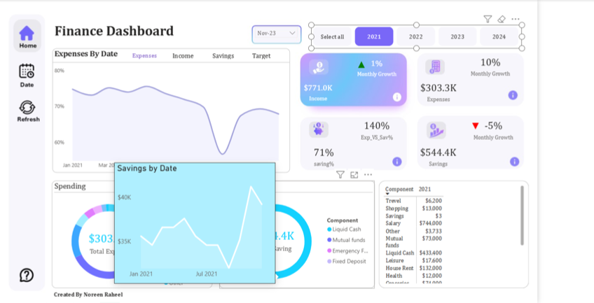

# 💰 Finance Analytics Dashboard

## 📌 Project Overview

This Finance Analytics Dashboard was developed using **Power BI** to analyze financial performance, profitability, expenses, revenue trends, and key business KPIs.

The dashboard provides interactive insights that help stakeholders monitor financial health, identify growth opportunities, and support data-driven decision-making.

---

## 🛠️ Tools & Technologies

- Power BI
- DAX
- Power Query
- Data Modeling
- Star Schema
- Data Visualization
- Business Intelligence

---

## 🚀 Dashboard Features

✅ Interactive Financial KPIs

✅ Revenue & Profit Analysis

✅ Expense Tracking

✅ Profit Margin Analysis

✅ Budget vs Actual Performance

✅ Financial Trend Analysis

✅ Regional Performance Analysis

✅ Dynamic Filters & Slicers

✅ Interactive Visualizations

---

## 📈 Key Insights

- Revenue Performance Analysis
- Profitability Tracking
- Expense Monitoring
- Budget vs Actual Comparison
- Financial Growth Trends
- Regional Financial Performance
- KPI Monitoring
- Business Performance Evaluation

---

## ⚙️ Technical Features

- Star Schema Data Model
- DAX Measures
- Time Intelligence Functions
- KPI Calculations
- Interactive Filtering
- Data Transformation using Power Query
- Financial Performance Metrics
- Business Reporting Framework

---

## 📊 Dashboard Pages

### Executive Overview
- Revenue
- Profit
- Expenses
- Profit Margin
- Financial KPIs

### Financial Analysis
- Revenue Trends
- Expense Trends
- Profitability Analysis
- Growth Metrics

### Regional Performance
- Region-wise Revenue
- Profit Analysis
- Performance Comparison

### Budget Analysis
- Budget vs Actual
- Variance Analysis
- Financial Targets

---

## 📷 Dashboard Preview

### Overview Dashboard

### Financial Analysis

### Regional Analysis

### Budget Analysis

---

## 🎯 Business Value

This dashboard helps organizations:

- Track financial performance
- Monitor revenue and expenses
- Improve profitability
- Identify financial trends
- Support strategic decision-making
- Optimize budget planning

---

## 📂 Repository Contents

- Finance_Dashboard.pbix
- Finance_Dashboard.mp4
- finance1.png
- finance2.png
- finance3.png
- finance4.png

---

## 🔗 Repository Link

https://github.com/NoreenVizLogix/finance-dashboard-powerbi

---

## 👨‍💻 Author

**Noreen Raheel**

Data Analyst | Power BI Developer | Business Intelligence Analyst

### Connect With Me

🔗 LinkedIn:
www.linkedin.com/in/noreen-raheel-data-analyst

🔗 GitHub:
https://github.com/NoreenVizLogix

📧 Email:
noreensajjad70@gmail.com

---

⭐ If you found this project useful, please consider giving it a star.
